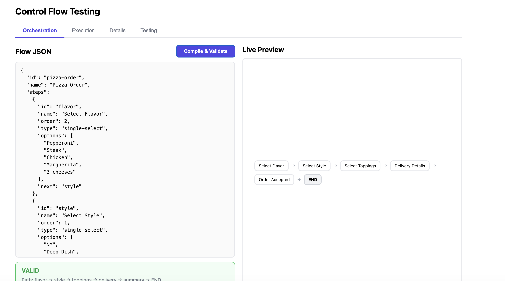
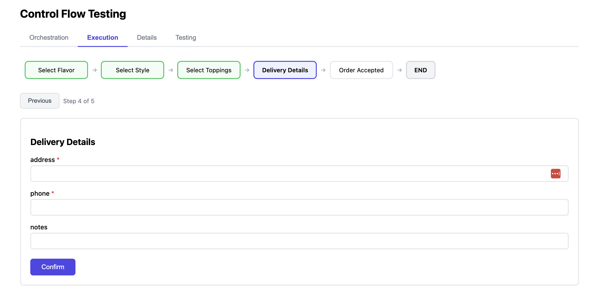
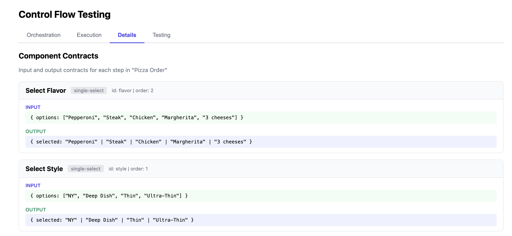
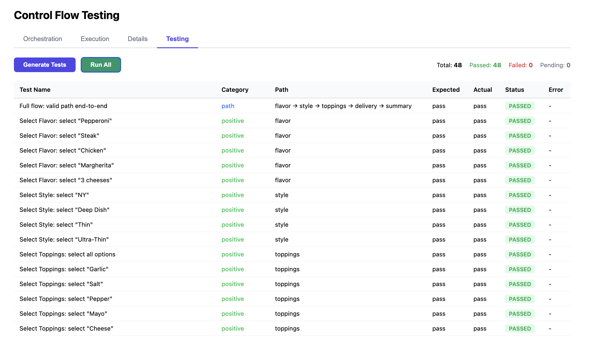

# Control Flow Testing

Generic dynamic multi-step application engine. Define flows via JSON, execute them, inspect contracts, and auto-generate tests.

### Stack
React, TypeScript, Vite, Bun, TanStack

### Run
```bash
./run.sh
```

### Screenshots

| Tab | Screenshot |
|-----|-----------|
| Orchestration |  |
| Execution |  |
| Details |  |
| Testing |  |
