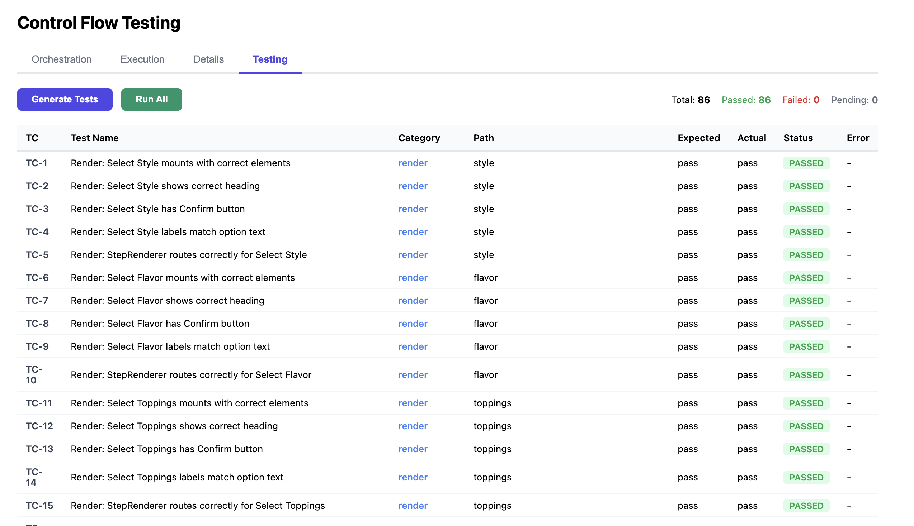

# Control Flow Testing

Generic dynamic multi-step application engine. Define flows via JSON, execute them, inspect contracts, and auto-generate tests.

### Stack
React, TypeScript, Vite, Bun, TanStack

### Run
```bash
./run.sh
```

### Screenshots

| Tab | Screenshot |
|-----|-----------|
| Orchestration |  |
| Execution |  |
| Details |  |
| Testing |  |

## Testing Categories

After the json is compiled, all tests are generated and run on the fly.
```
┌───────────────┬───────────────────────────────────────────────────────────────────────────────────────┬────────────────────────────────┐
│   Category    │                                         Tests                                         │          What they do          │
├───────────────┼───────────────────────────────────────────────────────────────────────────────────────┼────────────────────────────────┤
│ Render        │ elements, heading, confirm btn, labels, data values, required indicator (*),          │ Mount components, assert DOM   │
│               │ StepRenderer routing                                                                  │                                │
├───────────────┼───────────────────────────────────────────────────────────────────────────────────────┼────────────────────────────────┤
│ Positive      │ each option select+submit, change selection, multi-select 1/2/all, form               │ Click/type, verify callback    │
│               │ all/required-only/optional-included, summary display                                  │ data                           │
├───────────────┼───────────────────────────────────────────────────────────────────────────────────────┼────────────────────────────────┤
│ Negative      │ empty confirm disabled, double-click, deselect, deselect-all, missing required        │ Verify blocked/error states    │
│               │ fields, all-empty, error recovery                                                     │                                │
├───────────────┼───────────────────────────────────────────────────────────────────────────────────────┼────────────────────────────────┤
│ Integration   │ full forward, back-nav, restart, back-from-first, revisit, summary-data, min-flow     │ Full ExecutionPage in          │
│               │                                                                                       │ FlowProvider                   │
├───────────────┼───────────────────────────────────────────────────────────────────────────────────────┼────────────────────────────────┤
│ Boundary      │ long input, XSS, unicode, optional-empty, whitespace-required, single-option,         │ Edge cases                     │
│               │ rapid-click                                                                           │                                │
├───────────────┼───────────────────────────────────────────────────────────────────────────────────────┼────────────────────────────────┤
│ Permutation   │ reversed array, swapped positions, order field ignored                                │ Reorder steps array, verify    │
│               │                                                                                       │ next pointers win              │
├───────────────┼───────────────────────────────────────────────────────────────────────────────────────┼────────────────────────────────┤
│ Validation    │ valid flow, cycle, orphan, duplicate ID, invalid type, broken next, no terminal,      │ Feed bad JSONs to graph        │
│               │ missing options, empty steps                                                          │ compiler                       │
├───────────────┼───────────────────────────────────────────────────────────────────────────────────────┼────────────────────────────────┤
│ Idempotency   │ double run, restart-clean                                                             │ Complete flow twice, check no  │
│               │                                                                                       │ state leaks                    │
├───────────────┼───────────────────────────────────────────────────────────────────────────────────────┼────────────────────────────────┤
│ Accessibility │ radio name attribute, form labels, button text content                                │ A11y checks on rendered        │
│               │                                                                                       │ components                     │
└───────────────┴───────────────────────────────────────────────────────────────────────────────────────┴────────────────────────────────┘
```
