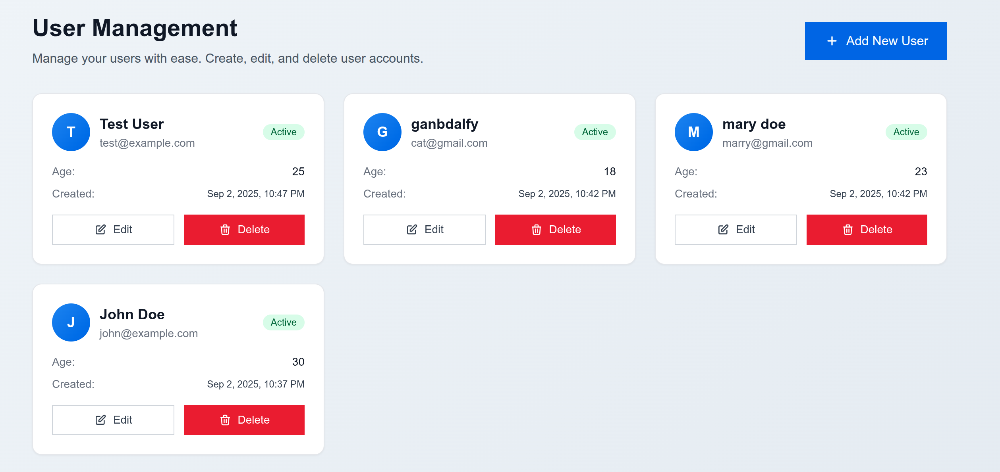
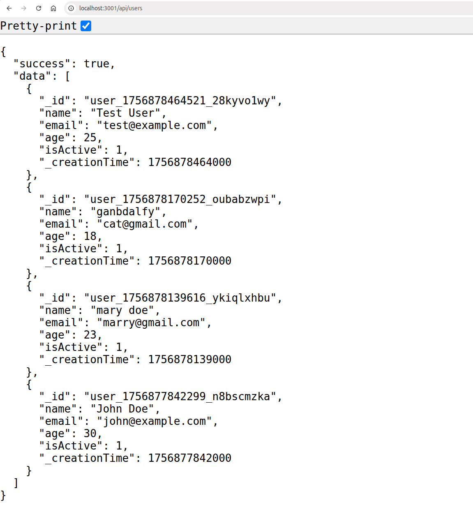

# Express TypeScript Convex MySQL Application

A full-stack application with Express.js backend, Next.js frontend, Convex database, and MySQL integration.

## Results

Frontend (NextJS) <br/>
 <br/>

Backend (Express/Convex) <br/>
 <br/>

## Features

- **Backend**: Express.js with TypeScript, strict type checking
- **Frontend**: Next.js 15 with React 19, TypeScript
- **Database**: Convex for real-time data, MySQL 9 for additional storage
- **Validation**: Zod schemas for type-safe data validation
- **Styling**: Tailwind CSS for responsive design
- **Docker**: Multi-container setup with Docker Compose

## Prerequisites

- Docker and Docker Compose
- Node.js 24+ (if running locally)
- Convex account and deployment

## Setup

1. **Clone and navigate to the project:**
   ```bash
   cd express-ts-convex-mysql
   ```

2. **Configure environment variables:**
   ```bash
   cp .env.example .env
   ```
   
   Update the `.env` file with your Convex configuration:
   - `CONVEX_DEPLOYMENT`: Your Convex deployment name
   - `CONVEX_DEPLOY_KEY`: Your Convex deploy key  
   - `NEXT_PUBLIC_CONVEX_URL`: Your Convex URL

3. **Start the application:**
   ```bash
   docker-compose up --build
   ```

## Services

- **Frontend**: http://localhost:3000
- **Backend API**: http://localhost:3001
- **MySQL**: localhost:3306
- **Health Check**: http://localhost:3001/health

## API Endpoints

### Users
- `GET /api/users` - Get all users
- `GET /api/users/:id` - Get user by ID
- `POST /api/users` - Create user
- `PUT /api/users/:id` - Update user
- `DELETE /api/users/:id` - Delete user

### Request/Response Examples

**Create User:**
```json
POST /api/users
{
  "name": "John Doe",
  "email": "john@example.com",
  "age": 30,
  "isActive": true
}
```

**Response:**
```json
{
  "success": true,
  "data": { "id": "user_id" },
  "message": "User created successfully"
}
```

## Development

### Local Development (without Docker)

1. **Backend:**
   ```bash
   cd backend
   npm install
   npm run dev
   ```

2. **Frontend:**
   ```bash
   cd frontend
   npm install
   npm run dev
   ```

### Type Checking

The project uses strict TypeScript configuration with no `any` types allowed:

```bash
# Backend
cd backend && npm run type-check

# Frontend  
cd frontend && npm run type-check
```

## Technology Stack

- **Backend**: Express.js, TypeScript, Zod, Convex, MySQL2
- **Frontend**: Next.js 15, React 19, TypeScript, Tailwind CSS, React Query
- **Database**: Convex, MySQL 9
- **DevOps**: Docker, Docker Compose

## Project Structure

```
├── backend/                 # Express.js API server
│   ├── src/
│   │   ├── controllers/    # Request handlers
│   │   ├── routes/         # API routes
│   │   ├── middleware/     # Express middleware
│   │   ├── types/          # TypeScript type definitions
│   │   └── config/         # Configuration files
│   ├── convex/             # Convex functions and schema
│   └── Dockerfile
├── frontend/               # Next.js application
│   ├── app/                # App router pages
│   ├── components/         # React components
│   ├── hooks/              # Custom React hooks
│   ├── lib/                # Utility functions
│   ├── types/              # TypeScript types
│   └── Dockerfile
├── mysql-init/             # MySQL initialization scripts
└── docker-compose.yml      # Multi-container setup
```