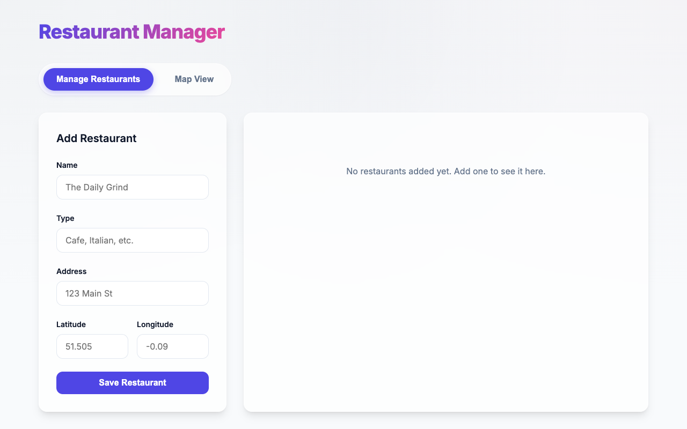

# Restaurant Manager

A modern, light-themed web application built with Node.js, Next.js 16.3, and TypeScript. This application provides a premium user interface for managing restaurants, featuring a sleek design with glassmorphism effects and smooth micro-interactions.



## Features

- **Restaurant CRUD**: Create, read, update, and delete restaurant entries.
- **Interactive Map View**: Visual representation of restaurant locations on an interactive grid map.
- **Premium UI/UX**: Designed with modern aesthetics, vibrant colors, custom typography (Inter), and glassmorphism.
- **Type-safe**: Fully written in TypeScript for robust data handling.
- **Next.js App Router**: Utilizing the latest React and Next.js paradigms.

## App Explanation

The application consists of two main tabs:

1. **Manage Restaurants (CRUD)**:
   - A dual-pane layout featuring an "Add Restaurant" form and a dynamic data table.
   - Users can input the restaurant's name, type, address, and X/Y coordinates for map placement.
   - The data table instantly reflects new additions and allows for deleting existing entries.

2. **Map View**:
   - Renders a responsive, interactive coordinate map.
   - Restaurants are plotted based on their X and Y coordinates.
   - Hovering over a map marker reveals a tooltip with the restaurant's details.

## How to Run

The repository includes convenient shell scripts to manage the application lifecycle.

### Start the Application

To install dependencies, build, and start the application in the background:

```bash
./start.sh
```

### Stop the Application

To safely terminate the background process:

```bash
./stop.sh
```

### Manual Usage

If you prefer to run it manually via npm:

```bash
npm install
npm run dev
```

The application will be accessible at `http://localhost:3000`.
