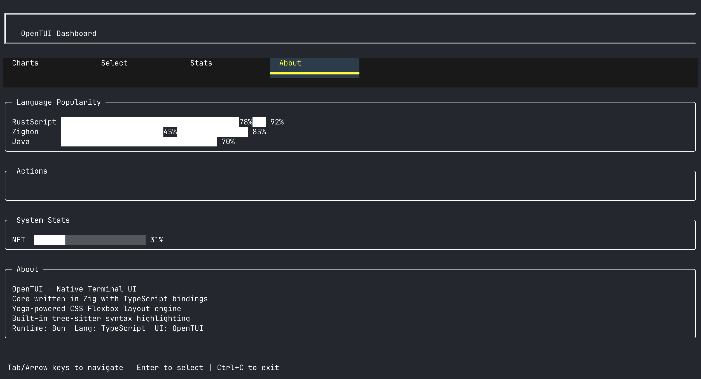

# OpenTUI POC

POC using OpenTUI - a native terminal UI core written in Zig with TypeScript bindings.
It uses Bun as the runtime and TypeScript.

OpenTUI provides a component-based architecture for building terminal user interfaces
with a Yoga-powered CSS Flexbox layout engine.

### Features

* Native TUI core (Zig) with TypeScript bindings
* CSS Flexbox layout via Yoga
* Component-based: Box, Text, Input, Select, and more
* Built-in tree-sitter syntax highlighting
* Keyboard handling and focus management

### Stack

* Bun
* TypeScript 5
* OpenTUI (@opentui/core)

### Build

```bash
bun install
```

### Run

```bash
./run.sh
```

### Result

Renders a styled terminal dashboard with tabs, bar charts, select menu, system stats, and about section.
Press `Ctrl+C` to exit.


