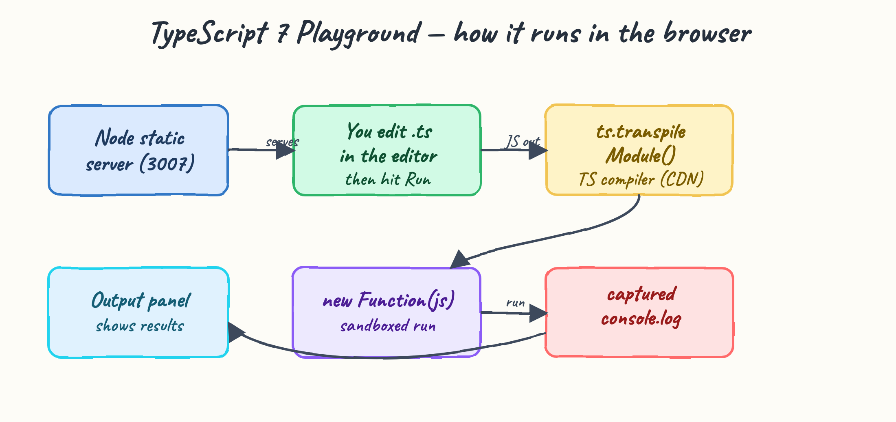
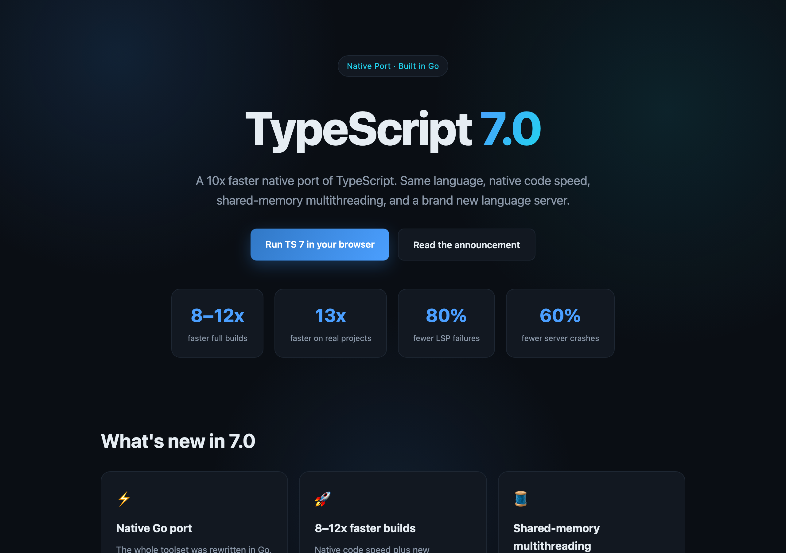
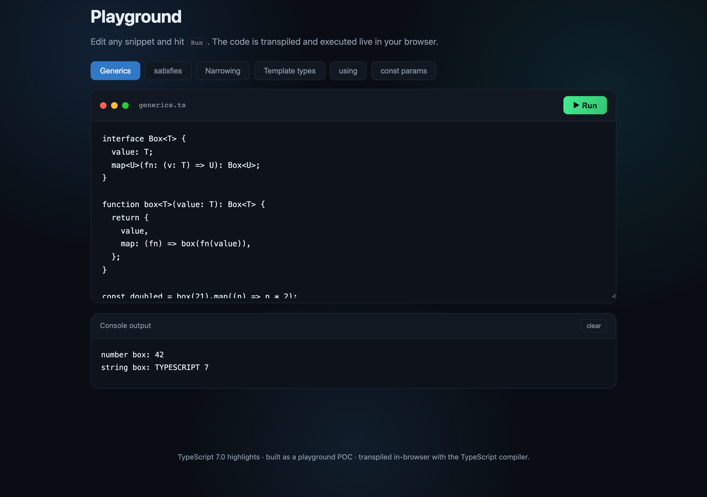
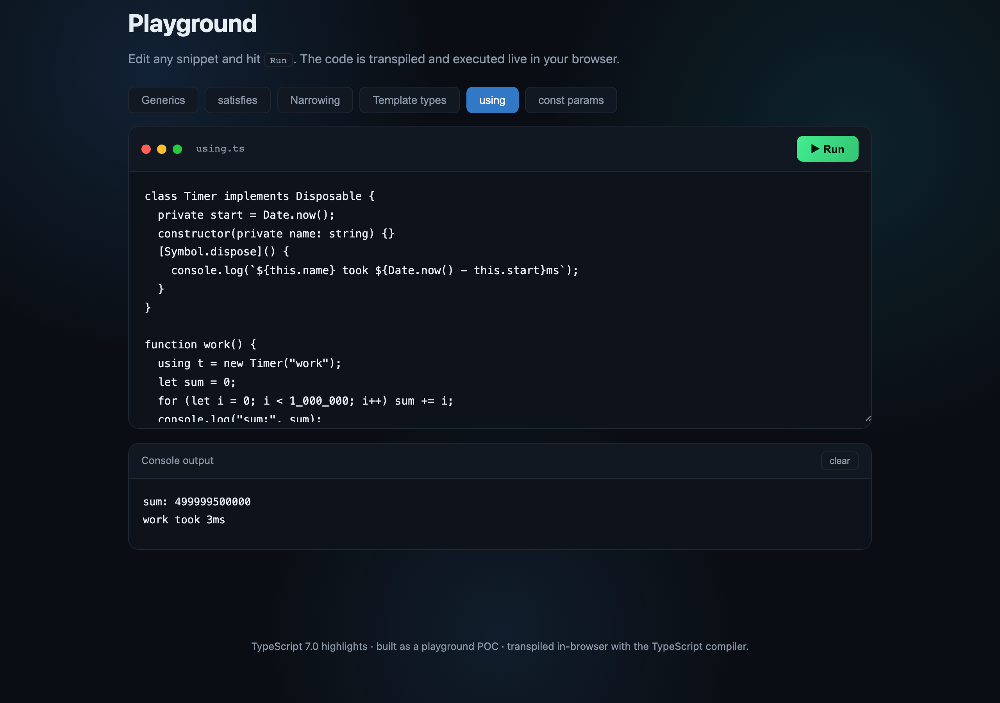

# TypeScript 7.0 — Interactive Playground

A small website that highlights the new features of **TypeScript 7.0** (the [10x faster native port](https://devblogs.microsoft.com/typescript/announcing-typescript-7-0/)) and lets you **run TypeScript live in the browser**. Edit any snippet, press Run, and the code is transpiled and executed with the output captured into a console panel.

## What TypeScript 7 brings

| Feature | Summary |
| --- | --- |
| Native Go port | The whole toolset was rewritten in Go, keeping the original structure and logic so results stay compatible with TypeScript 6. |
| 8–12x faster builds | Native code speed plus new optimizations, with over 13x observed on real projects. |
| Shared-memory multithreading | Parsing, checking and emitting run in parallel. Tune with `--checkers` and `--builders`, or force one thread with `--singleThreaded`. |
| New language server | A rebuilt LSP-based server cut failing commands by over 80% and crashes by over 60% versus 6.0. |
| Runs side-by-side with 6.0 | Re-exports the 6.0 API; keep old tooling via `npm install -D typescript@npm:@typescript/typescript6`. |
| Same install, next tag | `npm install -D typescript`, or nightly builds via `typescript@next`. |

## How it works



The Node static server serves the page. In the browser, the TypeScript compiler transpiles your edited `.ts` snippet, the result runs inside a `new Function` sandbox with a captured `console`, and the output is shown in the console panel.

## Running

```bash
./start.sh    # serves on http://localhost:3007
./stop.sh     # stops the server
./test.sh     # starts, checks the endpoints, stops
```

## The site

Hero and feature highlights:



Playground running a generics snippet live:



The `using` (explicit resource management) snippet executing in the browser:



## Snippets included

`Generics` · `satisfies` · `Narrowing` · `Template types` · `using` · `const params` — each is editable and runnable, printing to the console panel.

## Test output

```
Started on http://localhost:3007 (pid ...)
PASS / contains 'TypeScript'
PASS / contains 'playground'
PASS /playground.js contains 'transpileModule'
PASS /styles.css contains 'editor-wrap'
Stopped
```

## Stack

- Plain HTML / CSS / JS, no build step and no framework.
- Node's built-in `http` module for the static server (no dependencies).
- TypeScript compiler loaded from CDN for in-browser transpilation.
