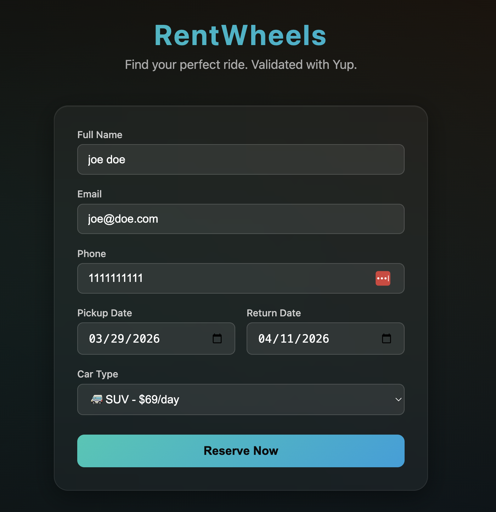
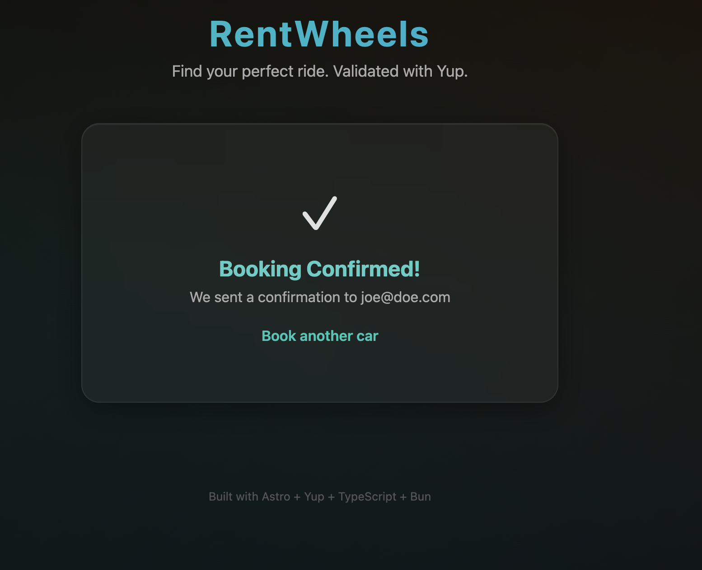

# RentWheels - Car Rental App

A car rental web application built with **Astro**, **Yup** schema validation, **TypeScript 6**, and **Bun**.

Based on the article [Zod vs Yup vs TypeBox](https://dev.to/dataformathub/zod-vs-yup-vs-typebox-the-ultimate-schema-validation-guide-for-2025-1l4l), this project uses **Yup** for its chainable validation API and clear error messages — ideal for form-heavy apps.

## Screenshots

The rental form with all fields filled in — Yup validates name, email, phone (regex), dates, and car type server-side on submit.



After successful validation the user sees a confirmation screen with the email they provided.



## Stack

* **Astro 6** — Server-side rendered pages with built-in form handling
* **Yup 1.7** — Schema validation with chainable rules and `InferType` for TS types
* **TypeScript 6** — Strict type checking
* **Bun** — Fast JS runtime and package manager

## How It Works

1. User fills in the rental form (name, email, phone, dates, car type)
2. On submit, the form POSTs to the same Astro page
3. Yup validates all fields server-side with `abortEarly: false` (shows all errors at once)
4. If valid -> confirmation screen. If invalid -> inline error messages per field.

## Yup Validation Features Used

* `string().required()` / `min()` / `email()` — basic field rules
* `matches()` — regex-based phone validation
* `oneOf()` — enum constraint for car types
* `InferType` — derives TypeScript types from the schema
* `abortEarly: false` — collects all validation errors in one pass

## Run

```
chmod +x run.sh
./run.sh
```

Open http://localhost:4321

## Project Structure

```
src/
  schemas/rental.ts   -> Yup schema + validation logic
  pages/index.astro   -> Car rental form + success page
```
